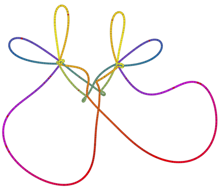

# HINGE

CI Status: 


## Introduction 

HINGE is a long read assembler based on an idea called _hinging_.

## Pipeline Overview

HINGE is an OLC(Overlap-Layout-Consensus) assembler. The idea of the pipeline is shown below. 


At a high level, the algorithm can be thought of a variation of the classical greedy algorithm.
The main difference with the greedy algorithm is that rather than each read having a single successor,
and a single predecessor, we allow a small subset of reads to have a higher number of successors/predecessors.
This subset is identified by a process called _hinging_. This helps us to recover the graph structure
directly during assembly.

Another significant difference from HGAP or Falcon pipeline is that it does not have a pre-assembly or read correction step. 


## Algorithm Details

### Reads filtering
Reads filtering filters reads that have long chimer in the middle, and short reads.
Reads which can have higher number of predecessors/successors are also identified there. 
This is implemented in `filter/filter.cpp`

### Layout 
The layout is implemented in `layout/hinging.cpp`. It is done by a variant of the greedy algorithm.

The graph output by the layout stage  is post-processed by running `scripts/pruning_and_clipping.py`.
One output is a graphml file which is the graph representation of the backbone.
This removes dead ends and Z-structures from the graph enabling easy condensation.
It can be analyzed and visualized, etc. 


## Parameters

In the pipeline described above, most programs not only takes the input file and output file as arguments, but also require a configuration file in ini format. This consists parameters for each step in the pipeline, and their usage and effects are explained below:


###[filter]
- length_threshold = 6500; // Length threshold for reads to be considered in the backbone
- quality_threshold = 0.23; // Quality threshold for edges to be considered in the backbone 
- n_iter = 2; // iterations of filtering, the filtering needs several iterations, because when filter reads, you got rid of some edges; when filter edges, you got rid of some reads (if the last edge is filtered.) Typically 2-3 iterations will be enough.
- aln_threshold = 2500; // Length of alignment for edges to be considered in the backbone
- min_cov = 5; // Minimal coverage for a segment to be considered not chimer/adaptor
- cut_off = 200; // A parameter for identifying long chimer in the middle of a read
- theta = 300; // A parameter for tolerance of the overhang length when looking for right extension.


###[running]
- n_proc = 12; // number of CPUs for layout step

###[draft]
- min_cov = 10; //obsolete
- trim = 200; //obsolete
- edge_safe = 100; //obsolete
- tspace = 900; //space between new "trace points"


###[consensus]
- min_length = 2000; // Minimal length of reads used for final consensus
- trim_end = 200; // Trim ends for alignments for final consensus
- best_n = 1; // If one read has multiple alignments with the bacbone assembly, choose the longest n segments for consensus.
- quality_threshold = 0.23; // alignment quality threshold

# Installation

This software is still at prototype stage so it is not well packaged, however it is designed in a modular flavor so different combinations of methods can be tested. 

Installing the software is very easy. 

```
git clone https://github.com/fxia22/HINGE.git
git submodule init
git submodule update
./build.sh
```

# Running

In order to call the programs from anywhere, I suggest one export the directory of binary file to system environment, you can do that by using the script `setup.sh`.

A demo run for assembling the ecoli genome is the following:

```
source setup.sh
mkdir data/ecoli
cd data/ecoli
# reads.fasta should be in data/ecoli
fasta2DB ecoli reads.fasta
DBsplit -x500 -s100 ecoli     
HPCdaligner -t5 ecoli | csh -v
# alternatively, you can put output of HPCdaligner to a bash file and edit it to support 
rm ecoli.*.ecoli.*
LAmerge ecoli.las ecoli.*.las
rm ecoli.*.las # we only need ecoli.las
DASqv -c100 ecoli ecoli.las

# Run filter
Reads_filter --db ecoli --las ecoli.las -x ecoli --config utils/nominal.ini

# Run layout
hinging --db ecoli --las ecoli.las -x ecoli --config utils/nominal.ini -o ecoli

# Run postprocessing

python pruning_and_clipping.py ecoli.edges.hinges ecoli.hinge.list <identifier-of-run>

# get draft assembly 

get_draft_path.py  ecoli ecoli<identifier-of-run>.G2.graphml
draft_assembly --db ecoli --las ecoli.las --prefix ecoli --config utils/nominal.ini --out ecoli.draft


# get consensus assembly
correct_head.py ecoli.draft.fasta ecoli.draft.pb.fasta draft_map.txt
fasta2DB draft ecoli.draft.pb.fasta 
HPCmapper draft ecoli | zsh -v  
LAmerge draft.ecoli.las draft.ecoli.*.las
consensus draft ecoli draft.ecoli.las ecoli.consensus.fasta utils/nominal.ini
get_consensus_gfa.py ecoli ecoli<identifier-of-run>.G2.graphml ecoli.consensus.fasta

#results should be in ecoli_consensus.gfa
```

## Debugging

### showing ground truth on graph
Some programs are for debugging and oberservation. For example, one can get the ground truth by mapping reads to reference and get `ecoli.ecoli.ref.las`.

This `las` file can be parsed to json file for other programs to use. 

```
run_mapping.py ecoli ecoli.ref ecoli.ecoli.ref.las 1-$ 
```

In the prune step, if `ecoli.mapping.json` exists, the output `graphml` file will contain the information of ground truth. 

### drawing alignment graphs and mapping graphs
Draw a read, for example 60947, and output figure to `sample` folder (need plus 1 as LAshow counts from 1):

```
draw2.py ecoli ecoli.las 60948 sample 100
```

Draw pileup on draft assembly, given a region(start,end):

```
draw2_pileup_region.py  3600000 4500000 
```

# Results:

For ecoli 160X dataset,  after shortening reads to have a mean length of 3500 (with a variance of 1500), the graph is preserved.



The graph returned by Falcon here is


